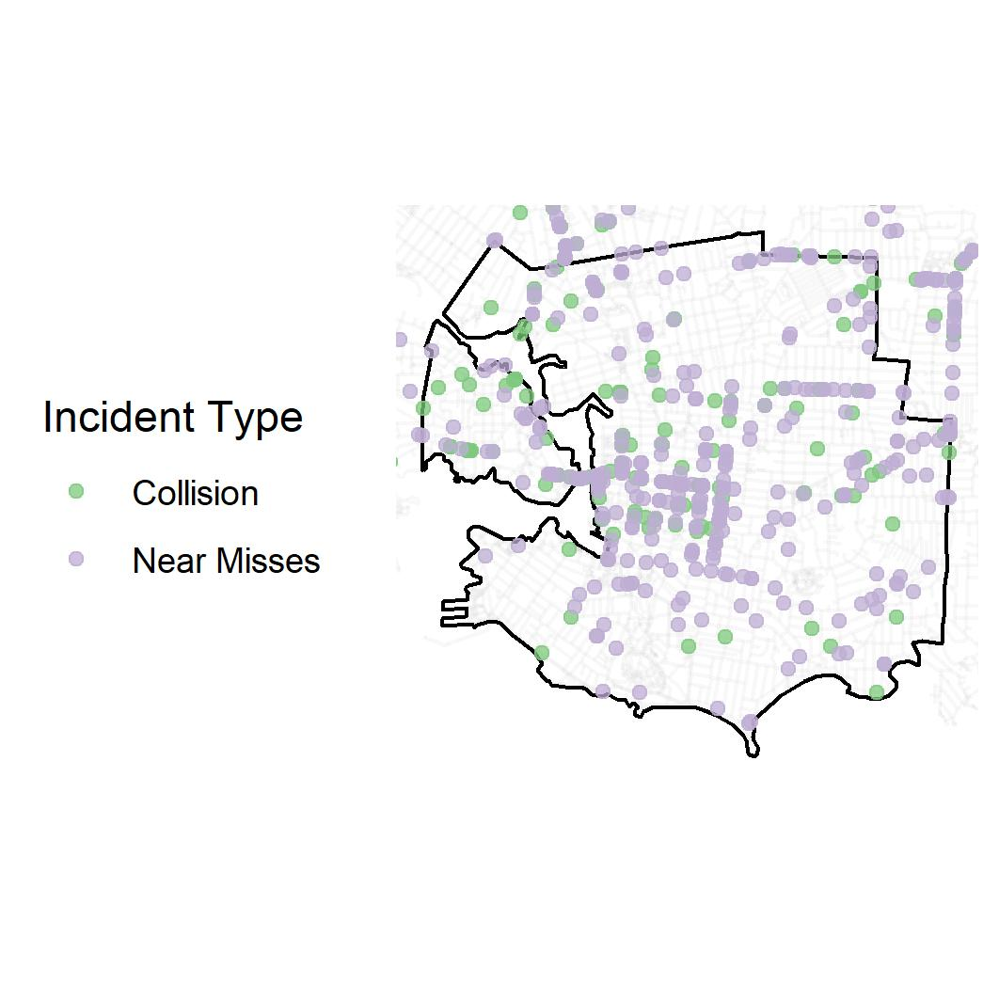
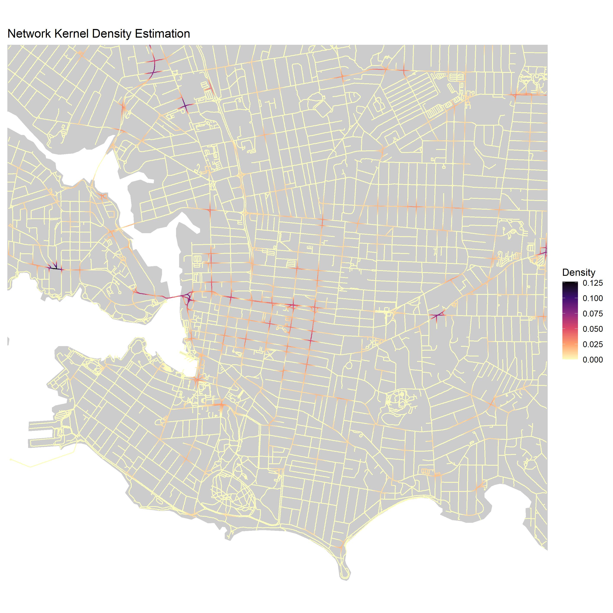

# Spatial-Clustering-R

Github repo for implementing point pattern analysis along networks in R

## Point Pattern on a Network

  

## Network Kernel Density
Created R function to implement network based KDE from algorithm outlined in [Xie & Yan (2008)](https://www.sciencedirect.com/science/article/pii/S0198971508000318)
  
  - Split network into "lixels" of certain length (1D version of pixels) using function "lixelize_network"
  - Input the point pattern and the lixelized network into function "network_kde"
  

  

