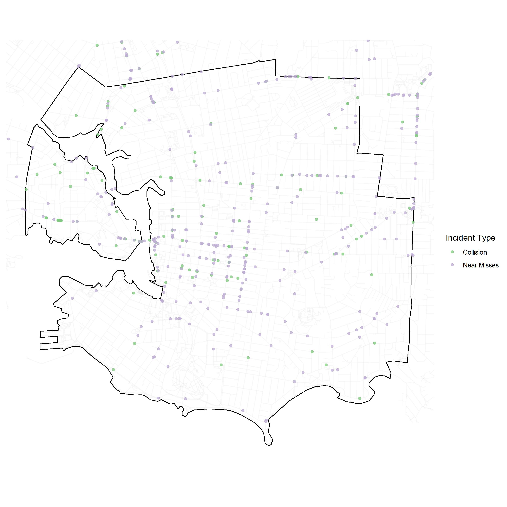
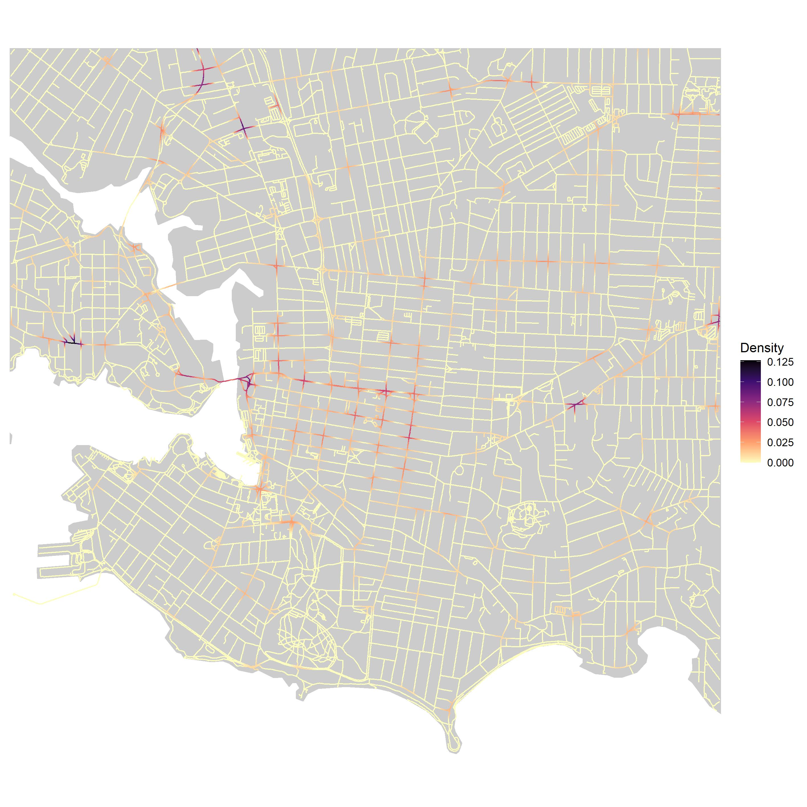

# Spatial-Clustering-R

## Point Patterns

  

## Network Kernel Density

Implemented network based KDE from algorithm outlined in [Xie & Yan (2008)](https://www.sciencedirect.com/science/article/pii/S0198971508000318) in function "network_kde"
  - The network KDE is a a 1-D version of the planar kernel density estimator, with bandwidth based on network distances, rather than Euclidean distances
  - Network split into "lixels" (1-D version of pixels)
  - We test 4 bandwidth values: 50m,100m,250m and 500m
  - We compare hotspots derived by taking the top 10%, 5%, 1% and 0.1% of lixel density values
  - We keep the lixel size constant at 10m.

  

